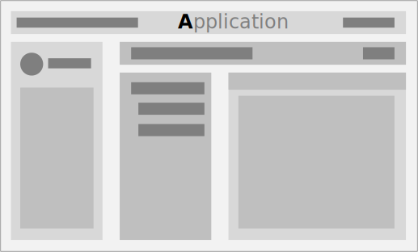
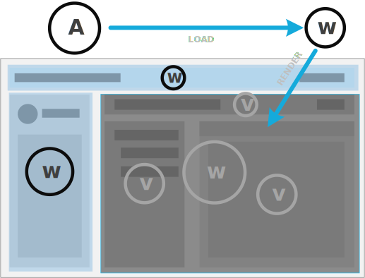
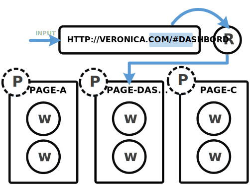
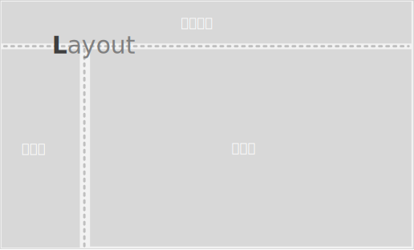
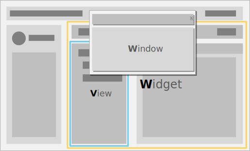
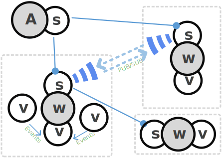

# 深入理解一些概念

## 什么是应用程序

在 veronica 库中，把独立的一张网页或单页面应用（Single Page Application）看作一个应用程序，举个例子，假设现在有一个项目管理的Web应用，那么项目管理应用本身就被视为一个应用程序。



**创建 App**

应用程序是一个复杂对象，在引入 veronica 库后，通过 `createApp` 方法创建：

```js
var app = veronica.createApp({
	/* options */
    name: 'app-project-manager'
});
```

除了传入app的名称，在创建app时，还可以传入一些其他参数，包括app包含哪些模块、扩展等

**启动 App**

在app创建后，需要进行启动，用于加载模块、扩展等外部组件

```
app.launch().done(function(){
	console.log('app started');
})
```

`launch`方法返回的是一个Promise对象（jQuery实现）

**模块**

从实践角度，稍微具有一定规模的项目就会划分成多个模块，模块即是一组功能的划分，并且通常与具体的项目规划和业务相联系，在项目管理app中，它的功能模块可能包括：项目管理、甘特图、日历、Wiki、讨论区等

在veronica中，一个app有哪些模块，需要通过配置项传入，这样app可通过配置决定是否加载某个模块，进行灵活组合以构建应用：

```js
var app = veronica.createApp({
    name: 'app-project-manager',
    modules:['project', 'gantt', 'wiki']
});
```

相应的，应该为每一个模块以模块名建立一个独立的文件夹，用于为不同的模块放不同的业务代码

有时候，模块也有一个入口文件（entrance file），用于读取与该模块相关的一堆扩展、页面、部件、插件等配置，在应用在启动时，它会加载这个入口文件，载入模块，读取该模块相关的配置

```js
// 在应用启动时才加载模块
app.launch()
```

**扩展（Extension）**

扩展是在核心库不能满足开发的情况下，用户引入的第三方库或自己定义的公共方法，扩展是一个**方法**，在它调用时被传入app实例对象

有两种方式引入扩展，一种是使用`app.use`方法：

```js
var extension = function(app){
	app.ext.sayHello = function(){
    	alert('hello world');
    }
}
app.use(extension);
```


另一种是在app创建时通过配置声明，这种方式适用于以AMD定义的外部模块：

```js
var app = veronica.createApp({
    name: 'app-project-manager',
    modules:['project', 'gantt', 'wiki'],
    extensions:['./ui']
});
```

```js
// ui.js
define(function(){
	return function(app){
    	app.ext.noop = function(){ }
    }
});
```

## 如何呈现界面

在 veronica 的世界中，一个界面被划分为多个 **widget（部件）**，它是功能呈现的基本单元，是一个可复用的前端结构，包含了实现一个功能完整的界面逻辑和交互操作

### 创建 WIDGET

用户通常只需要定义成一个简单对象，系统会自动根据这个对象创建一个`Widget`实例

```js
// 创建一个 widget
var widget_header = {
	template: '<%= data.name %>, Hello World!',
    defaults: {
    	autoAction: true
    }
};

// 注册 widget
app.widget.register('header', widget_header);

```

#### WIDGET的注册

在调用widget前，需要进行widget注册，这样才能根据注册的名称找到widget并创建它的实例；如果没有进行注册，那么它会远程加载**widget包**，获取该widget对象

#### WIDGET包

当一个widget较复杂（通常需要多个JS文件），同时也可能包含长段的HTML、CSS等时，需要将这些文件放到单独的文件夹进行管理，并以 widget名称作为该文件夹的名称

widget包内文件按照[CommonJS规范](http://wiki.commonjs.org/wiki/Packages/1.1)组织，并且每个JS文件是符合AMD规范的，这样就能使用AMD模块加载器从服务器直接以包的形式加载该widget

* widget1/main.js

```js
define(['./templates/index.html'], function(tpl){
	return {
    	template: 'tpl'
    }
});
```

* widget1/templates/index.html

```html
<div>hello world</div>
```

**widget 包放置的位置**

远程加载包首先要解决一个从哪里加载的问题，默认情况下，应用程序加载部件包是从默认模块的widgets目录加载，例如，你调用 `app.widget.start({ name: 'widget1' })`，那么系统将会查找到 `./widgets/widget1/main.js` 作为该widget的入口脚本，如果未找到，则会报错，另外，也通过设置 `options._source` 可以指定应用程序从不同的源去查找包


**什么是”源“**

源（source）是一个路径，表示可以从这个路径加载资源，同时也可以给这个路径命名，这样便可以直接使用源名指代这个路径

> 如果配置了模块，那么该模块的widgets路径，会自动设置为以该模块名称命名的一个源

### 使用 WIDGET

1、 直接在HTML中使用

```html
<!-- 在div上实例化 "header" widget，并传入 name 参数 -->
<div data-ver-role="header" data-options="{ name: 'Xu' }"></div>
```

2、使用JS调用

```js
// 启动一个 'header' widget，添加到界面作为 body 元素的子级
app.widget.start({
	name: 'header',
    options: {
    	host: 'body'
    }
});
```

`app.widget.start` 一般不直接调用，应通过 `app.page.change` 间接调用


> widget 应该是可独立分发的，包含构成该界面模块功能所需的所有HTML & CSS & JS

那么在使用该名称命名的widget时，app会尝试根据名称和配置去远程加载


### widget的组织管理

上面提到应用程序可以划分为很多个功能模块，因此不同的 widget 可能来自于不同的功能模块，在源码组织的时候，应将该widget的代码放到该功能模块对应的文件目录下，如下所示：

```
 |-- modules/
   |-- dashboard/
     |-- widget1/
     |-- widget2/
   |-- account-manage
```

## 怎么应对界面变化

软件界面的操作本质上是用户不断与界面进行交互，界面不断变化以响应用户各种交互需求的过程，因此界面框架的核心是处理界面如何进行变化

首先，对于界面的变化，这里暂且把它们分为三类：

* 小变化：表单值、控件状态改变，动画效果，信息呈现隐藏等
* 中变化：模态窗口、界面局部发生重大变化等
* 大变化：界面主要内容发生完全改变

针对这三种变化，传统的Web站点采取了一视同仁的处理方式，即在不同网页间进行跳转，这其实没什么问题，并且符合HTML的初衷，但仔细思考这些变化的差异，当在界面需要变化较小的时候，实际上它所带来的资源消耗和界面影响应该和较大变化时是不同的，理应采用不同的处理方式

> 这里暂且不论单页面应用和传统Web网站对比的优劣性，veronica在两种类型的Web前端实践中都适用，你可以用在传统网站中，也可以用在单页面应用中，当然一开始设计时为单页面应用考虑多一些，因此最佳使用场景还是后者。另外，不同的使用场景考虑的状况不一样，可能veronica的构建方式也不一样



在veronica中，有一些可以参考的准则去应对这些变化，它们适用于整站ajax的单页面应用，也适用于传统的Web网站：

* 小变化 -->  widget内部解决，通常需要控制DOM与数据间映射的关系，或使用MVVM绑定
* 中变化 -->  widget调用其他widget或创建新的view
* 大变化 -->  应用程序改变 page

### 一些重要概念

**页面（Page）**这个词指代的不是一般意义上的网页页面，而是一种可以称之为逻辑页面的东西，通常在使用veronica构建单页面应用的时候使用

普通程序和单页面程序中切换页面都是可通过浏览器地址改变而发生，传统网页切换页面需要经历完整的页面加载过程，而单页面程序切换页面则是通过替换页面上的某一部分HTML来形成一定的界面变化，造成用户所感知的页面切换

后者为了维持地址栏和界面变化的关系映射，需要使用特殊的装置去监听路由的变化，这种装置称为：**路由器(Router)**。



前面提到，在veronica中，整个页面是模块化的，由一个个**部件（Widget）**组成，当用户切换页面时，应用程序所做的工作就是销毁旧widget，实例化新widget，所以不同的页面就相当于widget的不同组合，它本质就是一堆配置，包含自己所需要的widget清单

页面通常还应指定它的**布局（Layout）**，这个不难理解，它通常是一段HTML文本，布局的使用有多种方式，可以在布局中放置widget的宿主元素，在布局加载后进行解析，也可以在布局中放置一些空的标签作为占位符用于放置一个个widget，这样便于复用

使用者可以通过CSS调整布局中各元素的位置关系，同时每个页面可以指定一个布局（但不能指定多个），多个页面可以共用一个布局，当应用程序切换页面时，如果这两个页面布局不同，则会先进行布局切换，再进行页面切换



### 深入WIGET(部件)内部

**部件**是一个对象，内部包含**沙箱（Sandbox）**、**视图（View）**、**窗口（Window）**等元素



**沙箱**可以看作部件的内核，能唯一标识该部件、部件通过沙箱与外界进行通信，访问应用程序公共方法和对象。沙箱具有层级关系，因此内部用它来管理父级、子级宿主对象。应用程序对象也有一个沙箱，它是所有其他沙箱的父级，主要进行部件管理和全局信息传递

**视图（view）**是界面组成的基本单元，管理一个界面区域的初始化、渲染、事件及销毁等工作。部件呈现界面的具体操作是通过视图完成的，一个与用户界面相关的部件至少有一个视图，这个视图称为主视图，负责渲染这个部件最主要的界面，同时作为该部件的实例对象，一个部件也可以包括多个视图，每个视图负责渲染特定的界面，视图与视图间通过事件进行信息传递



部件作为一个可复用的结构，可在不同的业务场景下使用，当需要修改或扩展某个部件的行为时，应该怎么做？如果该部件是自己开发的并拥有该部件代码的完整控制权，那么大可以修改该部件源码以适配新增的业务场景；如果引用一个别人已打包发布的部件，而且不能更改源码，这时候就应该使用插件的方式进行扩展，使用**插件（Plugin）**可在不改变部件代码的情况下，改变部件的默认行为，并且一个部件可指定多个插件，可通过配置文件停用和启用某个插件，插件是部件扩展的比较合理的方案


